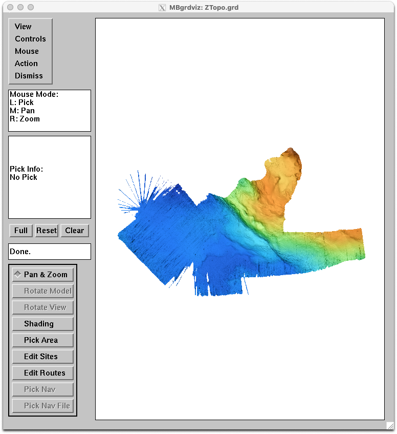

--
# Dockerized MB-System
--

This directory contains a Dockerfile used to automatically build an MB-System Docker image based on Debian 12 Linux and publish this image to Docker Hub, where it can be publicly accessed.
This file documents how the MB-System Docker image can be used and how it is structured.

## Version
Modified 29 April 2024

## What are Docker images and containers?

A software container provides an isolated environment in which one or more applications can be run regardless of the host operating system configuration. The Docker platform provides the capabilities needed to create containers and to run those containers on many different sorts of computers. A good overview of how this works can be found at:
[https://docs.docker.com/get-started/overview/](https://docs.docker.com/get-started/overview/). 

Basically, if one installs the Docker engine software on a computer, be it Mac, Linux, Windows, or whatever, then one should be able to load and run an application included in a Docker container on this computer without needing to install the application directly. The container is created from a Docker image, which contains all of the operating system elements and software installations needed to run the desired application.

## MB-System Docker Image

The MB-System Docker image is built using Debian 12 Linux and the current MB-System release, and is updated each time a new MB-System release is made. The current release is accessed using the "latest" tag in the Github repository: [https://github.com/dwcaress/MB-System/releases/latest](https://github.com/dwcaress/MB-System/releases/latest). This image is then available from the Docker Hub site at: [https://hub.docker.com/r/mbari/mbsystem](https://hub.docker.com/r/mbari/mbsystem)

The MB-System Docker image is run from a terminal command line on the host computer. Once the Docker container (a running Docker image) is active it presents as the command line in the same terminal window, and is accessing the same local directory as before. The difference is that the user can now run the MB-System and GMT programs installed in the Docker image.

## Running the MB-System Docker Available at Docker Hub on MacOs

The first requirement is to install and run the Docker Desktop application on your local computer, insuring that a Docker server process is running locally. In order to download the MB-System Docker Image, enter the following in a terminal shell:

	docker pull mbari/mbsystem:latest

The output to the shell should look something like:

	user@LOCALCOMPUTER% docker pull mbari/mbsystem:latest
	latest: Pulling from mbari/mbsystem
	609c73876867: Pull complete 
	c62b5ee91c24: Pull complete 
	ad71b3e3baf8: Pull complete 
	45076d4b5a6d: Pull complete 
	Digest: sha256:8fa5a3621be6eed759a910295b972733b1f6276494ec54f41ea490523e6c4bb0
	Status: Downloaded newer image for mbari/mbsystem:latest
	docker.io/mbari/mbsystem:latest
	
	What's Next?
	  View summary of image vulnerabilities and recommendations → docker scout 	quickview mbari/mbsystem:latest
	user@LOCALCOMPUTER% 

	
Your Docker Desktop should now show mbari/mbsystem as one of the available local images.

To start a Docker container using the MB-System Docker image, navigate a command line shell to a directory containing seafloor mapping data that you wish to process, and then enter a "docker run" command as described below. In order to run MB-System graphical tools such as mbedit, you must have an X Server running on the host with access control turned off using "xhost +", and have the environment variable DISPLAY in the container reference the X Server. If the local machine or host has an ip address of 192.168.25.26, then the X Server reference is "192.168.25.26:0". The following sequence of commands should work:

	xhost +
	export IP=192.168.25.26
	docker run -it --platform linux/amd64 --rm --network=host \
			--user mbuser \
			--env=LIBGL_ALWAYS_INDIRECT=1 \
			--env=DISPLAY=$IP:0 \
			--volume=$HOME/.bash_history:/opt/.bash_history \
			--volume=$PWD:$PWD \
			--volume=$PWD/logs:$PWD/Docker/logs \
			--workdir=$PWD \
			mbari/mbsystem

The command line will return with a changed cursor, indicating that you are executing a shell within the now-running Docker container. Now MB-System command line tools like mbinfo can be run:

	mbuser@docker-desktop:/Users/caress/TestData$ mbinfo -I 0010_20230405_034803_SallyRide_EM124.kmall
	
	Swath Data File:      0010_20230405_034803_SallyRide_EM124.kmall
	MBIO Data Format ID:  261
	Format name:          MBF_KEMKMALL
	Informal Description: Kongsberg multibeam echosounder system kmall datagram format
	Attributes:           Kongsberg fourth generation multibeam sonars (EM2040, EM712, 
                      EM304, EM124), bathymetry, amplitude, backscatter, variable beams, 
                      binary datagrams, Kongsberg.

	Data Totals:
	Number of Records:                         331
	Bathymetry Data (1024 beams):
	  Number of Beams:           338944
	  Number of Good Beams:      331453     97.79%
	  Number of Zero Beams:        6008      1.77%
	  Number of Flagged Beams:     1483      0.44%
	Amplitude Data (1024 beams):
	  Number of Beams:           338944
	  Number of Good Beams:      331453     97.79%
	  Number of Zero Beams:        6008      1.77%
	  Number of Flagged Beams:     1483      0.44%
	Sidescan Data (2048 pixels):
	  Number of Pixels:          677888
	  Number of Good Pixels:     615164     90.75%
	  Number of Zero Pixels:          0      0.00%
	  Number of Flagged Pixels:   62724      9.25%

	Navigation Totals:
	Total Time:             0.9972 hours
	Total Track Length:    12.7035 km
	Average Speed:         12.7390 km/hr ( 6.8859 knots)
	
	Start of Data:
	Time:  04 05 2023 03:47:59.852861  JD95 (2023-04-05T03:47:59.852861)
	Lon:  -118.154674778     Lat:    32.565430607     Depth:  1912.3238 meters
	Speed:  0.0000 km/hr ( 0.0000 knots)  Heading: 134.7583 degrees
	Sonar Depth:    4.1616 m  Sonar Altitude: 1908.1622 m
	
	End of Data:
	Time:  04 05 2023 04:47:49.825473  JD95 (2023-04-05T04:47:49.825473)
	Lon:  -118.042174701     Lat:    32.532130508     Depth:  1880.0739 meters
	Speed: 11.7805 km/hr ( 6.3678 knots)  Heading:  15.4361 degrees
	Sonar Depth:    4.1512 m  Sonar Altitude: 1869.7341 m
	
	Limits:
	Minimum Longitude:    -118.192882524   Maximum Longitude:    -118.008498980
	Minimum Latitude:       32.478656229   Maximum Latitude:       32.599855176
	Minimum Sonar Depth:     3.2535   Maximum Sonar Depth:     5.2087
	Minimum Altitude:     1840.1272   Maximum Altitude:     1947.1191
	Minimum Depth:        1625.6368   Maximum Depth:        2066.8716
	Minimum Amplitude:    -109.4064   Maximum Amplitude:      20.6295
	Minimum Sidescan:     -101.6000   Maximum Sidescan:       19.9000
	
	mbuser@docker-desktop:/Users/caress/TestData$ 

One can also run MB-System graphical tools such as mbedit, mbnavedit, mbvelocitytool, mbgrdviz, mbeditviz and mbnavadjust. The command

	mbgrdviz -I ZTopo.grd
	
will display the grid file ZTopo.grd using mbgrdviz.

All of the MB-System tools, plus GMT, can be run from the MB-System Docker container command line.

--