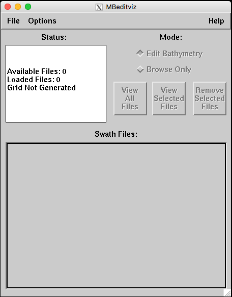

# GUI

Some preliminary references and notes toward enabling the MB-System GUI programs.

**Some refs**:

- https://github.com/mviereck/x11docker
- https://wiki.ros.org/docker/Tutorials/GUI
- https://nelkinda.com/blog/xeyes-in-docker/
- https://cntnr.io/running-guis-with-docker-on-mac-os-x-a14df6a76efc
- https://dev.to/darksmile92/run-gui-app-in-linux-docker-container-on-windows-host-4kde

**Some questions**

- Any preferred mechanism (X11/similar directly, VNC, on a web browser, ...)?
- Any priorities in terms of host OS (linux, Windows, MacOS)?

## MacOS

Reference: https://cntnr.io/running-guis-with-docker-on-mac-os-x-a14df6a76efc
(and this [comment](https://medium.com/@abhayghatpande/hi-nils-de-moor-thank-you-for-your-write-up-it-helped-me-a-lot-78b95df0f35c)).

    $ brew install socat
    $ socat TCP-LISTEN:6000,reuseaddr,fork UNIX-CLIENT:\"$DISPLAY\"

I already have XQuartz (2.7.11 -xorg-server 1.18.4) on my Mac, and with the security
settings as indicated in the article.
(likely I followed some similar reference a while ago)

    $ ip=$(ifconfig en0 | grep "inet " | sed 's/.*inet \([0-9\.]*\).*/\1/g');
    $ xhost + ${ip}
    
As initial basic test:

    $ docker run --rm -e DISPLAY=${ip}:0 gns3/xeyes
    
I can also run MB-System GUI programs, e.g.:

    $ docker run -it --rm -e DISPLAY=${ip}:0 $MBSYSTEM_IMAGE mbeditviz
    

## Windows

(untested)

- https://dev.to/darksmile92/run-gui-app-in-linux-docker-container-on-windows-host-4kde
